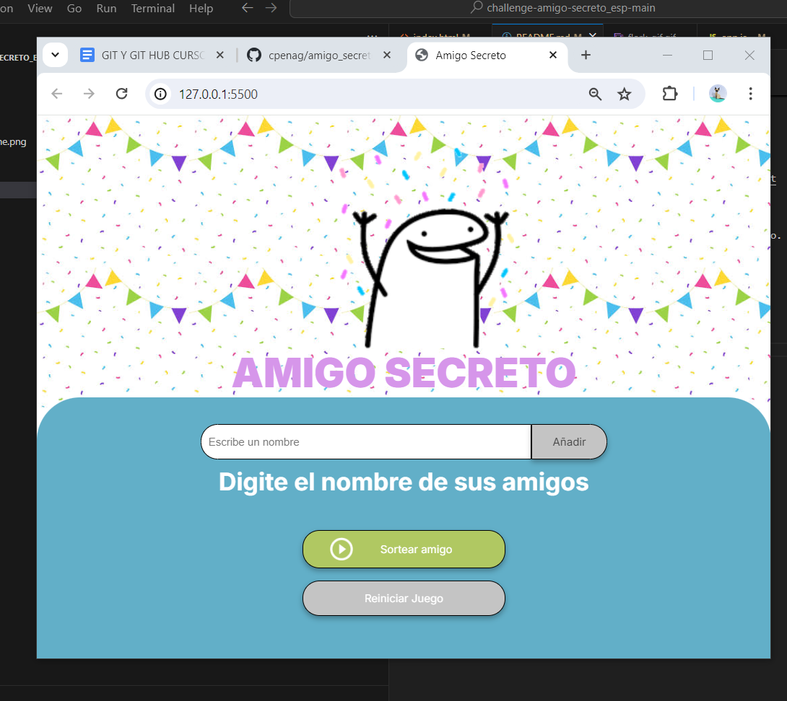
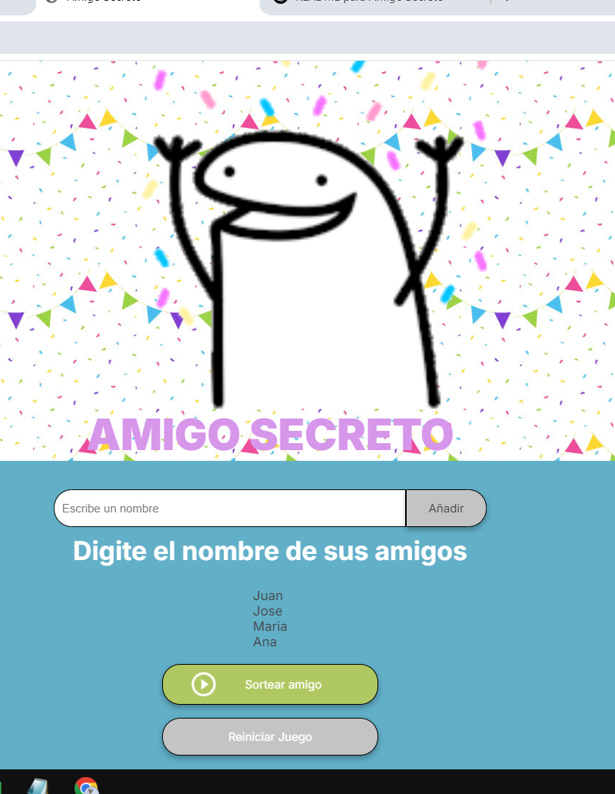
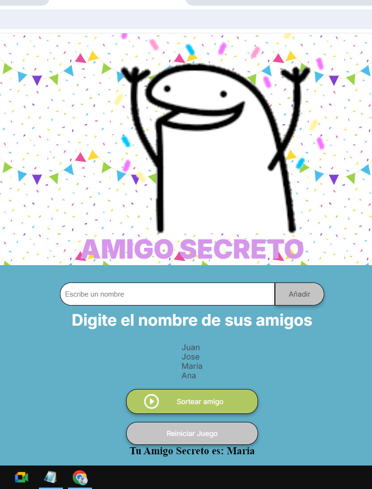

# amigo_secreto_one 

##  Descripción
Este proyecto permite a los usuarios ingresar nombres de amigos y sortear aleatoriamente un "Amigo Secreto". Cuenta con funciones para añadir amigos, actualizar la lista en tiempo real, realizar el sorteo y reiniciar el juego cuando se desee.
Desarrollado como parte del proceso de aprendizaje en el curso de Alura Latam y ONE, está dirigido a principiantes en programación que buscan mejorar sus habilidades mediante retos prácticos.

##  Características
- Añadir amigos a la lista.
- Visualizar los nombres agregados.
- Realizar un sorteo aleatorio de "Amigo Secreto".
- Reiniciar el juego y empezar de nuevo.

## Tecnologías Utilizadas
- HTML
- CSS
- JavaScript

## Uso
1. Clonar este repositorio:
 git clone https://github.com/tu-usuario/amigo-secreto.git
   
2. Abrir `index.html` en un navegador.
3. Ingresar nombres y presionar "Añadir".
4. Hacer clic en "Sortear amigo" para obtener un resultado.
5. Usar "Reiniciar Juego" para empezar de nuevo.

## 📷 Capturas de Pantalla

